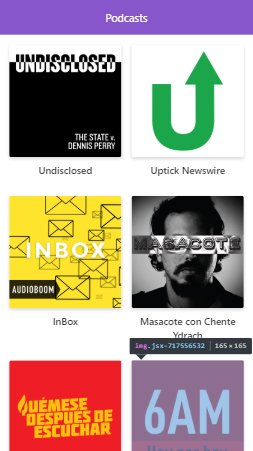

# App de Podcasts

App de Podcast usando la API de AudioBoom con React y Nextjs

##Autor

Kevin Kleber Rivamontan Alvarado
@SoySUperKleber

[Ver la App] (https://nextjscurso-juebfhoibo.now.sh)

## Cómo funciona?

Requiere node.js 

* `npm install` para instalar dependencias
* `npm run dev` para el entrono de desarrollo
* `mpm run build && npm start` para entorno de producción

## Licencia

MIT